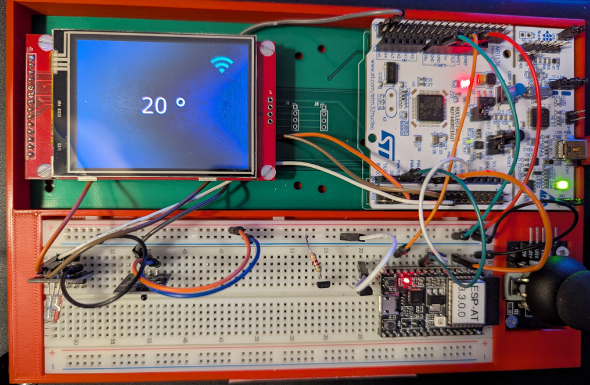
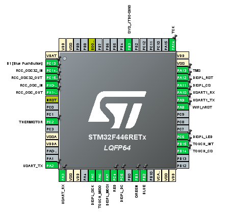

# tftTouchWifi


NucleoF446RE with ILI9341 and TouchGFX
Uses the AT software on an ESP32C3 connected to UART1 on PA9 and PA10.
WIFI_nRST on PA8.



A secrets.h file is needed with the following defined:
```
#define SSID "MYSSID"
#define PASSWD "MYPASSWORD"
#define WRITEAPIKEY "THINGSPEAK CHANNEL WRITE API KEY"
```
More details in the docs folder.
[docs/README.md](docs/README.md)
