# ARM with ESP32-C3 AT WiFi
## PART1: Install the library to use the ESP32AT WiFi module with the STM32.

Nima Askari has a nice library for use with the ESP32AT modem.

	https://github.com/nimaltd/atc

My fork of it is here: https://github.com/meldundas/atc

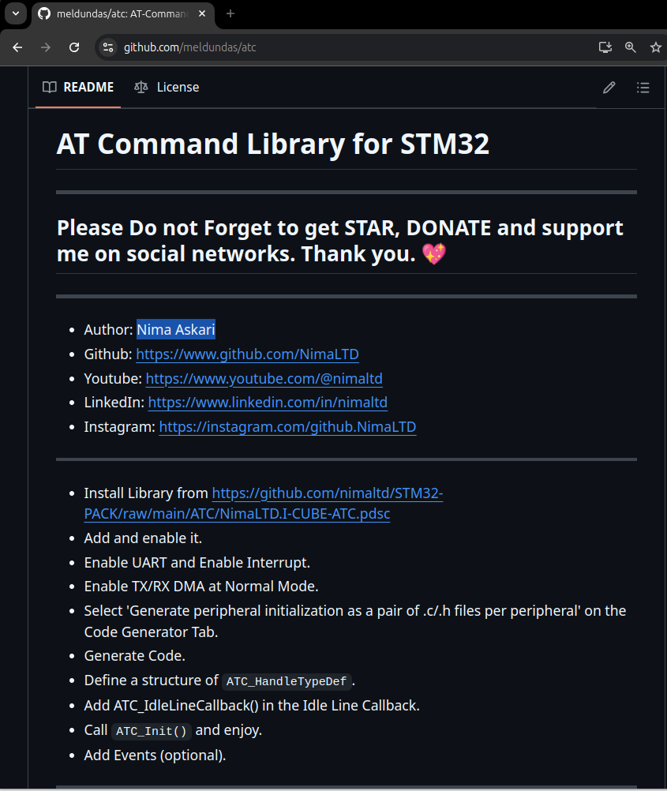

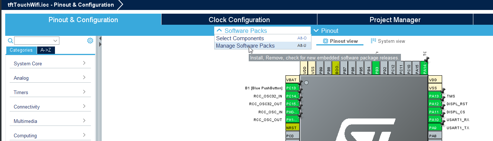

Click From URL below and enter the following:

https://github.com/nimaltd/STM32-PACK/raw/main/ATC/NimaLTD.I-CUBE-ATC.pdsc

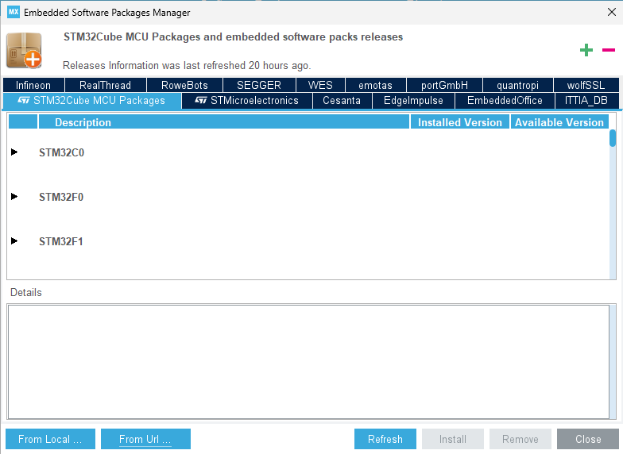

Click check, then OK, Then select it and click OK.

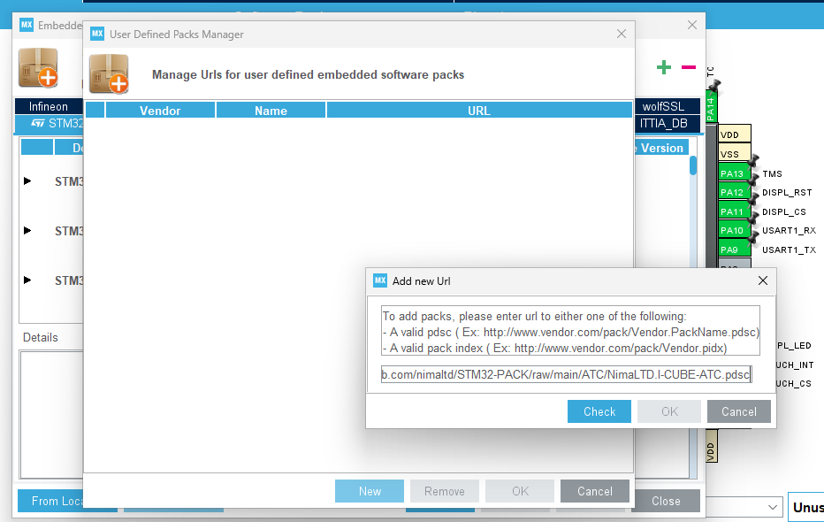

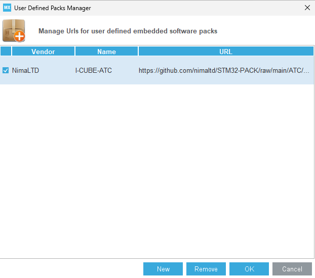

Click on the NimaLTD tab.

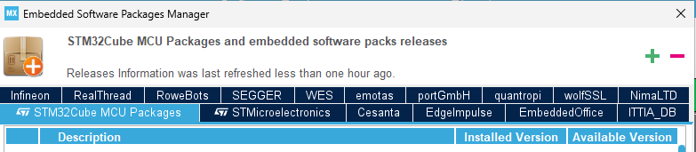

Click on install.

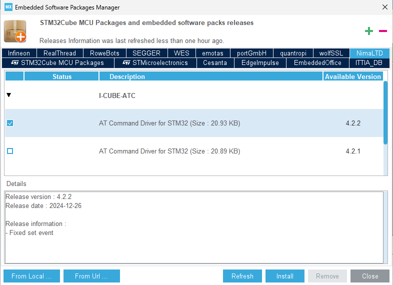

### Add and Enable it.

Select software packs selector and select the ATC driver.

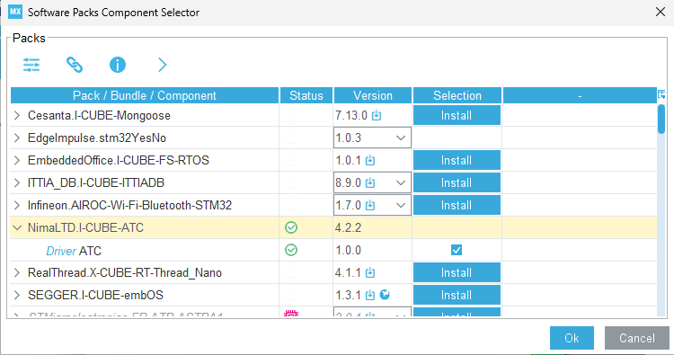

Under Middleware, select the I-CUBE-ATC and select Driver ATC.

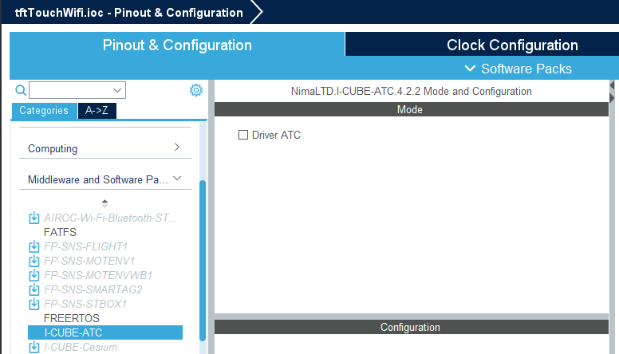
### Enable UART1 and configure interrupt.
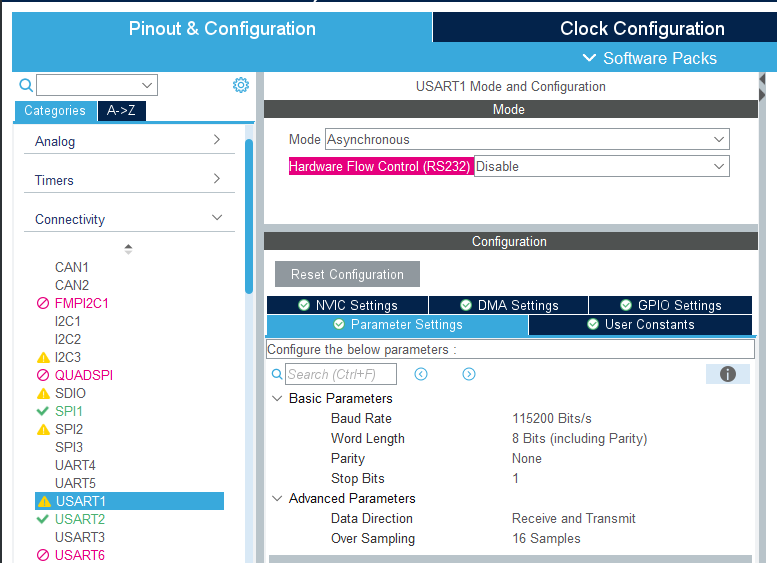
### Enable TX/RX DMA at Normal Mode.
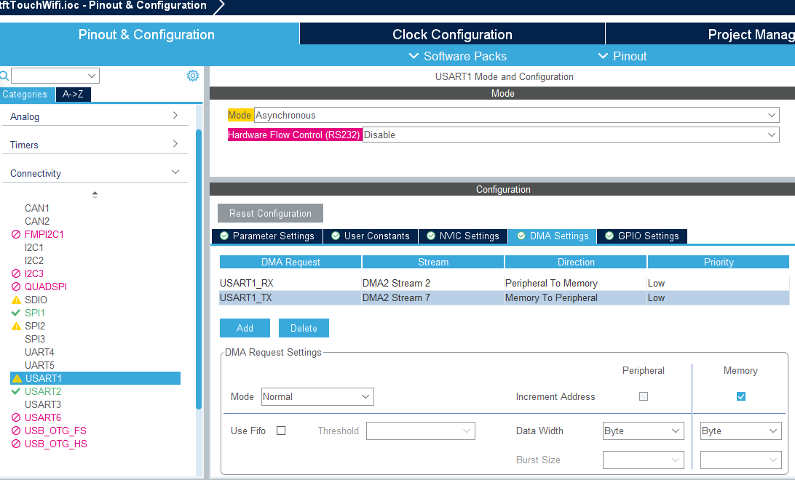
### Select 'Generate peripheral initialization as a pair of .c/.h files per peripheral' on the Code Generator Tab.
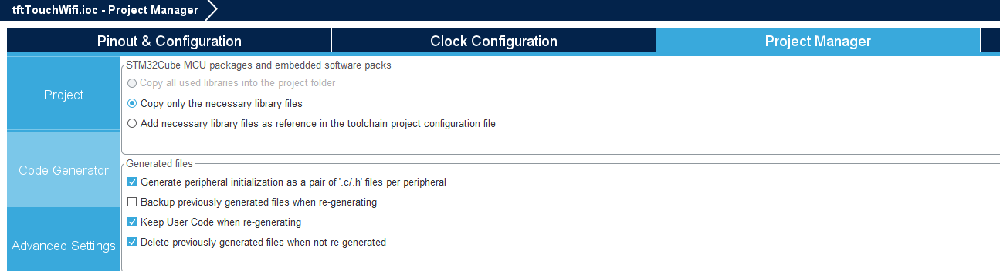
### Define a structure of ATC_HandleTypeDef.
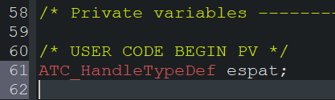
### Add ATC_IdleLineCallback() in the Idle Line Callback.
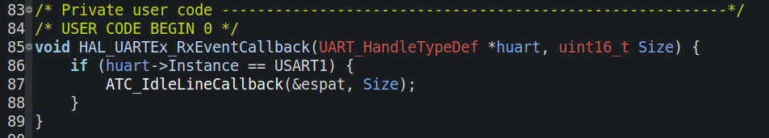
### Call ATC_Init() and enjoy.
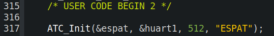

## PART2: Connect to WiFi
```
int WiFiConnect() {
	char data[80];
	//After 1st programming need to AT+CWMODE=1
	resp = ATC_SendReceive(&espat, "AT+CWMODE=1\r\n", 100, NULL, 100, 1,
			"OK\r\n");

	//check if connected to network
	//2: ESP32-C3 station has connected to an AP, and got an IPv4 address.
	//resp == 1 when we are connected and have an ip
	resp = ATC_SendReceive(&espat, "AT+CWSTATE?\r\n", 100, NULL, 1000, 1,
			"+CWSTATE:2");

	//if not connected reset esp32
	if (!resp) {
		HAL_GPIO_WritePin(WIFI_nRST_GPIO_Port, WIFI_nRST_Pin, GPIO_PIN_RESET);
		HAL_Delay(500);
		HAL_GPIO_WritePin(WIFI_nRST_GPIO_Port, WIFI_nRST_Pin, GPIO_PIN_SET);
		HAL_Delay(5000);

		//check network connection again
		//if not automatically connected on reset, connect to network

		resp = ATC_SendReceive(&espat, "AT+CWSTATE?\r\n", 100, NULL, 1000, 1,
				"+CWSTATE:2");
		if (!resp) {

			/********* AT+CWJAP="SSID","PASSWD" **********/
			//resp: 	1 if connected
			//		0 if not
			sprintf(data, "AT+CWJAP=\"%s\",\"%s\"\r\n", SSID, PASSWD);

			resp = ATC_SendReceive(&espat, data, 200, NULL, 10000, 1, "OK\r\						n"); //"GOT IP\r\n"
		}

	}

	return resp;

}

	return resp;

}
```

## PART3: Send to Thingspeak

```
int sendToThingspeak() {
	char data[80];
	char local_buf[80];

	if (!WiFiConnect()) {
		connected = false;
		wifiNotConnectedCount++;
	} else {
		connected = true;
		//send to thingspeak
		resp = ATC_SendReceive(&espat,
			"AT+CIPSTART=\"TCP\",\"184.106.153.149\",80\r\n", 500, NULL,
			5000, 1, "OK\r\n");

		sprintf(data, "GET /update?api_key=%s&field%d=%ld&field%d=%0.1f\r\n",
				WRITEAPIKEY, 1, count, 2, thermTemp);
		int len = strlen(data);

		sprintf(local_buf, "AT+CIPSEND=%d\r\n", len);
		resp = ATC_SendReceive(&espat, local_buf, 100, NULL, 100, 1, "OK\r\n");

		resp = ATC_SendReceive(&espat, data, 1000, NULL, 100, 1, "SEND OK\r\n");

		resp == 1 ? sentCount++ : notSentCount++;

//Closing the connection makes it worse
//	resp = ATC_SendReceive(&espat, "AT+CIPCLOSE\r\n", 1000, NULL, 100, 1, "OK\r\n");

	}

	//resp: 1 data sent
	//		0 error in tx
	return resp;

}

```

## PART4: Send to MQTT

```
int sendToMQTT() {
	char data[80];

	if (!WiFiConnect()) {
		wifiNotConnectedCount++;

		//not connected to wifi
		return 0;
	} else {

		//setup publish string
		sprintf(data, "AT+MQTTPUB=0,\"esp32c3/thermistor\",
			\"%0.1f\",0,0\r\n",thermTemp);

		resp =	ATC_SendReceive(&espat,
			"AT+MQTTUSERCFG=0,1,\"publisher\",\"esp32c3\",\"112233\",0,0,\"\"\r\n",
			100, NULL, 500, 1, "OK\r\n");

		resp = ATC_SendReceive(&espat, "AT+MQTTCONN?\r\n", 100, NULL, 100, 1,
			"+MQTTCONN:0,4,1");

		//if not connected, try to connect
		//setup for automatic reconnection
		//broker.emqx.io
		if (!resp) {
			resp = ATC_SendReceive(&espat,
				"AT+MQTTCONN=0,\"35.172.255.228\",1883,1\r\n", 100, NULL,
				5000, 1, "OK\r\n");
		}

		//send MQTT
		//1 -> OK
		//0 -> error
		resp = ATC_SendReceive(&espat, data, 100, NULL, 500, 1, "OK\r\n");

		return resp;
	}

}
```

## PART5: Subscribe to MQTT

```
int subscribeToMQTT() {
	char data[80];

	if (!WiFiConnect()) {
		wifiNotConnectedCount++;

		//not connected to wifi
		return 0;
	} else {

		//setup subscribe string
		sprintf(data, "AT+MQTTSUB=0,\"esp32c3/led\",1\r\n");

		resp =
				ATC_SendReceive(&espat,
						"AT+MQTTUSERCFG=0,1,\"subscriber\",\"esp32c3\",\"112233\",0,0,\"\"\r\n",
						100, NULL, 500, 1, "OK\r\n");

		resp = ATC_SendReceive(&espat, "AT+MQTTCONN?\r\n", 100, NULL, 100, 1,
				"+MQTTCONN:0,4,1");

		//if not connected, try to connect
		//setup for automatic reconnection
		//broker.emqx.io
		if (!resp) {
			resp = ATC_SendReceive(&espat,
					"AT+MQTTCONN=0,\"35.172.255.228\",1883,1\r\n", 100, NULL,
					5000, 1, "OK\r\n");
		}

		//send MQTT
		//1 -> OK
		//0 -> error
		resp = ATC_SendReceive(&espat, data, 100, NULL, 500, 1, "OK\r\n");

		return resp;
	}
//Closing the connection makes it worse
//	resp = ATC_SendReceive(&espat, "AT+CIPCLOSE\r\n", 1000, NULL, 100, 1, "OK\r\n");

}

```